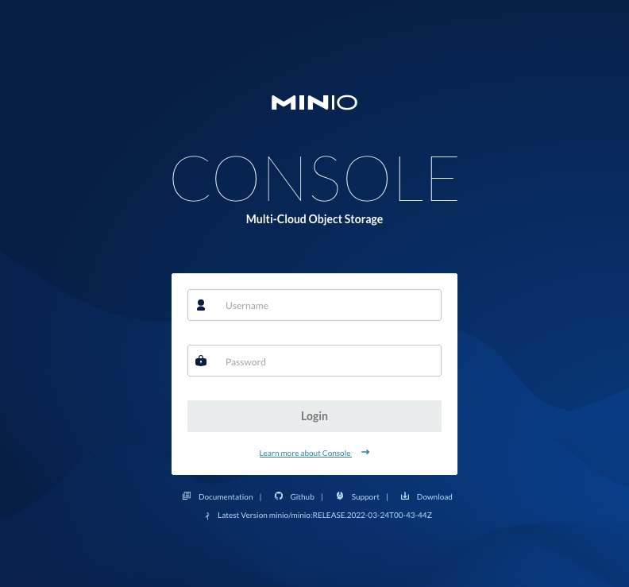
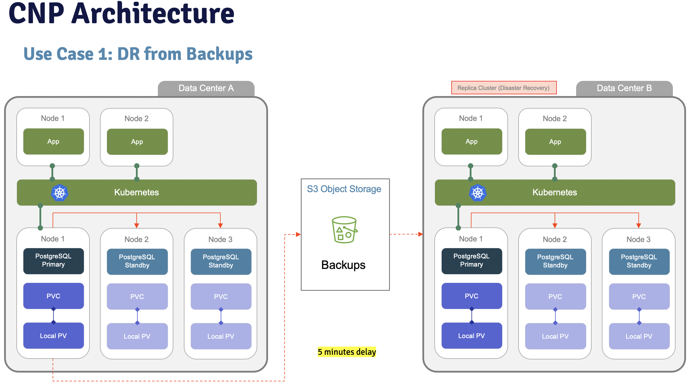
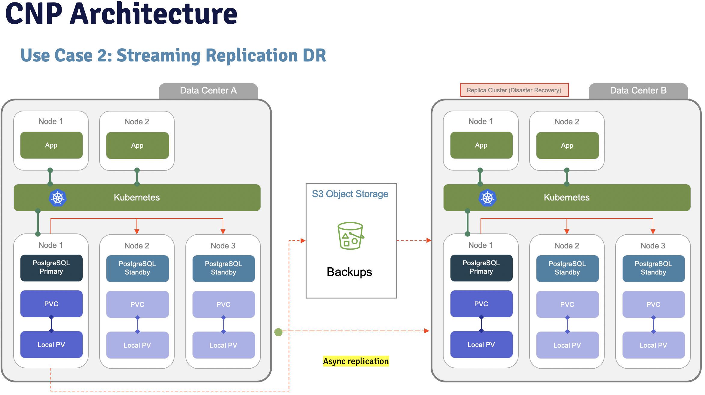
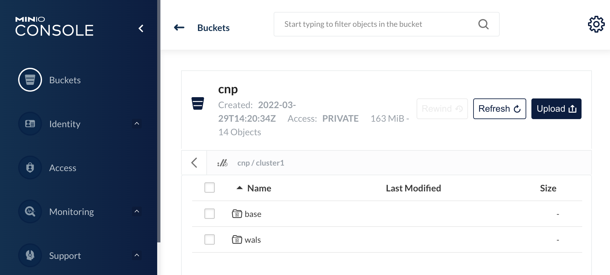

# Prerequisites
- Install Docker
- Install a kubernetes environment (I recommend [k3d](https://k3d.io/v5.3.0/))
- Install [MinIO](https://min.io/download#/kubernetes) Server
- AWS account (if backups in AWS)
- Install [AWS CLI (Command-line interface)](https://docs.aws.amazon.com/cli/latest/userguide/getting-started-install.html)
- AWS S3 bucket

# Description
This scripts will give you the availability to do a CNP (Cloud Native Postgres) demo in a kubernetes environment.
To copy data from one cluster to other, you must use an object storage. This demo has been configured to use MinIO (default configuration) or AWS S3.
If you have any problem, don't hesitate to contact me: sergio.romera@enterprisedb.com

# MinIO Users
If you are using MinIO to store backups ans WALs, start MinIO server before to continue with the test. MinIO will run in a Docker container.

```
./start_minio_docker_server.sh
Unable to find image 'minio/minio:latest' locally
latest: Pulling from minio/minio
Digest: sha256:16a0b1807bf9c7f1c2ea8558ae067a0352614e26bd4e6a898688a16d30747e31
Status: Downloaded newer image for minio/minio:latest
API: http://172.17.0.2:9000  http://127.0.0.1:9000

Console: http://172.17.0.2:9001 http://127.0.0.1:9001

Documentation: https://docs.min.io
```
To stop MinIO server, click on ctrl+C. Warning, all the data of your WAL files and backups will be dropped.

MinIO will be accessible from this URL: http://localhost:9001/login

User: admin
Password: password



# AWS Users
If will use AWS S3, modify install_secrets.sh file and configure AWS credentials to store backup files in a AWS S3 bucket
```
...
kubectl create secret generic aws-creds \
  --from-literal=ACCESS_KEY_ID=<access_key_id> \
  --from-literal=ACCESS_SECRET_KEY=<access_secret_key>
...
```


# Use case 1: Create cluster 1 and cluster 2 from S3 backups


# Test1 - DR: Create cluster2 from cluster1 from S3 backup
- Create cluster1
```
install_cnp.sh
```
- Backup cluster1
```
kubectl apply -f backup_cluster1.yaml
```
- Create cluster2
```
kubectl apply -f cluster2.yaml
```
- Activate cluster2 as Primary
```
kubectl apply -f cluster2_restore.yaml
```

# Use case 2: DR from cluster1 using wal streaming replication 


# Test2 - DR from cluster1 using wal streaming replication
- Create cluster1
```
install_cnp.sh
```
- Backup cluster1
```
kubectl apply -f backup_cluster1.yaml
```


- Create cluster2
```
kubectl apply -f cluster2_wal_streaming.yaml
```

# Test2 - Promote cluster2 (DR from cluster1)
- Be sure that all transactions are replicated (check LSN in cluster1 and cluster2)
- Apply file cluster2 wal streaming with backup
```
kubectl apply -f cluster2_wal_streaming_backup.yaml
```
- Verify that cluster2 has a primary node
- Execute a backup from cluster2
```
kubectl apply -f backup_cluster2.yaml
```


# Test2 - Rollback to cluster1
- Delete cluster1
```
kubectl delete -f cluster1.yaml
```
- Create cluster1 from cluster2
```
kubectl apply -f cluster1_wal_streaming_restore.yaml
```
- Verify that cluster1 is working well 
```
kubectl cnp status cluster1
```

# Usefull commands
```
# psql
select pg_switch_wal();
select pg_current_wal_lsn();
select current_user;

# kubectl
kubectl exec -it cluster1-1 -- psql
kubectl exec -it cluster2-1 -- psql
kubectl cnp promote cluster1 cluster1-2
kubectl apply -f backup_cluster1.yaml
kubectl describe backup backup-test
kubectl logs cluster1-1

# Port Forwarding
kubectl port-forward cluster1-1 5432:5432
kubectl port-forward service/cluster1-rw 5454:5432
```
